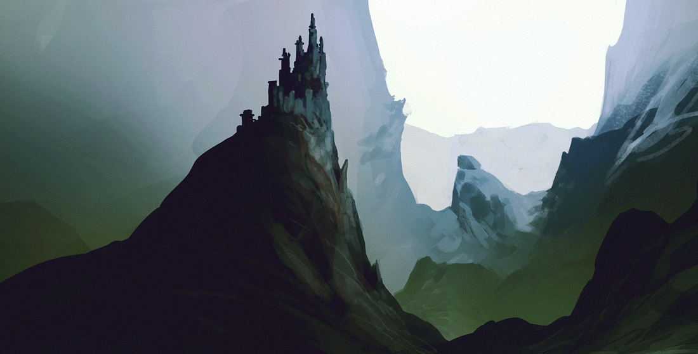

  

    
  

  

    <h1>Wåndyr</h1>
    

      Wåndyr is an adventure game inspired by the original roleplaying games
      but updated with fresh game mechanics. The game fits in a small 20
      page booklet. Read this first.
    

    

      <a href="docs/Wåndyr, an Adventure Game v0.5.pdf" target="_blank"
        >Wåndyr, an Adventure Game</a
      >
    

  

  

    <h1>Game Summary</h1>
    

      Wåndyr is an adventure game about a band of adventurers wandering through a pulp fantasy world. The focus is on exploration, following rumors, discovering new places, finding magic, treasure hunting, camping, singing, storytelling, cleverly overcoming impossible odds, and coming back alive with tales to tell.
    

    

      In the spirit of The Hobbit, Wåndyr celebrates the journey of going there and back again. The stories and songs of your characters emerge during play, filled with wonder and surprises that even the Guide doesn't anticipate. The game starts in an undefined "wilderland" that emerges during play, which you can optionally place somewhere in the fantasy world of your choice.
    

    <h3>Key Features</h3>
    <ul>
      <li><strong>Sandbox Style:</strong> The Guide describes the world but doesn't create a story beforehand. Each new discovery adds to the growing lore of your campaign world.</li>
      <li><strong>Simple Characters:</strong> Each character has two Traits and two Skills, making it quick to create and easy to play.</li>
      <li><strong>The Oracle:</strong> A unique system that answers yes/no questions instantly, often adding unexpected "sweet" or "spicy" flavor to keep adventures surprising.</li>
      <li><strong>OSR Compatible:</strong> Works with most Old School Roleplaying games while offering fresh mechanics.</li>
    </ul>
  

  

    <h1>The Oracle</h1>
    

      The Oracle is a simple but powerful system for answering questions during play. Roll 2d6: if the total is 8 or higher, the answer is "Yes"; otherwise, it's "No". Questions should be phrased so that characters want to hear "Yes", like "Do we find shelter?" or "Is the sword magical?"
    

    

      The Oracle adds flavor through "Sweet" and "Spicy" results. Roll a 6 on either die for a "Sweet" result, or a 1 for a "Spicy" result. On Sweet, the player asks a follow-up question; on Spicy, the Guide asks a question. The Oracle also excels at playing "20 questions" to reveal mysteries piece by piece.
    

    

      The Wåndyr World Oracle is a set of useful random tables to help generate the wilderland setting. Both Guide and players can use these tables to discover what lies beyond the next hill or behind the next door.
    

    

      <a href="docs/Wåndyr World Oracle.pdf" target="_blank"
        >Wåndyr World Oracle</a
      >
    

  

  <!-- Interactive Tools Section -->
  

    <h2>Game Tools</h2>
    
    <!-- Insight Spinner -->
    

      

        <h3>Insight Roller</h3>
        
Roll for Insight to claim advantage. Roll d6 each Turn.

        

          

            

              
TRAIT

              
ITEM

              
SKILL

              
NAME

              
ASSIST

              
EFFORT

              
TRAIT

              
ITEM

              
SKILL

            

          

          

            

              
TRAIT

              
ITEM

              
SKILL

              
NAME

              
ASSIST

              
EFFORT

              
TRAIT

              
ITEM

              
SKILL

            

          

          

            

              
TRAIT

              
ITEM

              
SKILL

              
NAME

              
ASSIST

              
EFFORT

              
TRAIT

              
ITEM

              
SKILL

            

          

        

        

          Roll for Insight...
        

        <button class="btn-roll" onclick="rollInsight()">Roll Insight</button>
      

    

    <!-- Oracle Dice -->
    

      

        <h3>Oracle Roller</h3>
        
Roll 2d6 for the Oracle. 8+ is "Yes", otherwise "No". Roll a 6 for "Sweet" or 1 for "Spicy".

        

          

            
1

            
2

            
3

            
4

            
5

            
6

          

          

            
1

            
2

            
3

            
4

            
5

            
6

          

        

        

          Roll the Oracle...
        

        <button class="btn-roll" onclick="rollOracle()">Roll Oracle</button>
      

    

  

  <!-- Tables Section - Automatically Generated -->
  

    <h1>Random Tables & Oracles</h1>
    

      Browse and use the extensive collection of random tables for worldbuilding, encounters, and adventure generation.
    

    
    

      
        

          {{ table.category | default: 'Table' }}
          <h3>{{ table.title }}</h3>
          
            
{{ table.description }}

          
          <a href="{{ table.url }}" class="btn-roll">View Table</a>
        

      
    

  

  

    <h1>AI Play</h1>
    

      Wåndyr is primarily a tabletop roleplaying game, designed for pencils,
      paper, and friends around a table. However, it also works well with AI
      tools, both for generating content and for solo play.
    

    

      Wåndyr has its own approach to spellcasting, but is compatible with
      spells from the original roleplaying game and similar. The Magic
      Oracle is an AI prompt to help the Guide generate spells and
      spellbooks.
    

    

      <a href="docs/Wåndyr Magic Oracle.pdf" target="_blank"
        >Wåndyr Magic Oracle</a
      >
    

    

      Nobody available this week? Wåndyr also works well for AI solo play.
      Create a new AI project, add the game rules and world oracle, and use
      this prompt to generate your adventure.
    

    

      <a href="docs/Wåndyr AI Solo Play.pdf" target="_blank"
        >AI Prompt for AI Solo Play</a
      >
    

  

  

    <h1>Version History</h1>
    

      <a href="docs/Wåndyr Version History v0.5.pdf" target="_blank"
        >Version History</a
      >
    

    

      <a href="docs/Wåndyr, an Adventure Game v0.5.pdf" target="_blank"
        >Wåndyr v0.5</a
      > (May 2025)
    

    

      <a href="docs/Wåndyr, an Adventure Game v0.2.pdf" target="_blank"
        >Wåndyr v0.2</a
      > (February 2025)
    

    

      <a href="docs/Wåndyr, an Adventure Game v0.1.pdf" target="_blank"
        >Wåndyr v0.1</a
      > (January 2025)
    

  

  <footer class="text-center">
    
Copyright © 2025 Paul Abrams

    

      All rights reserved. No part of this work may be reproduced or
      transmitted in any form or by any means whatsoever without express
      written permission from the author, except in the case of brief
      quotations embodied in critical articles and reviews. Please refer all
      pertinent questions to the publisher.
    

  </footer>

 